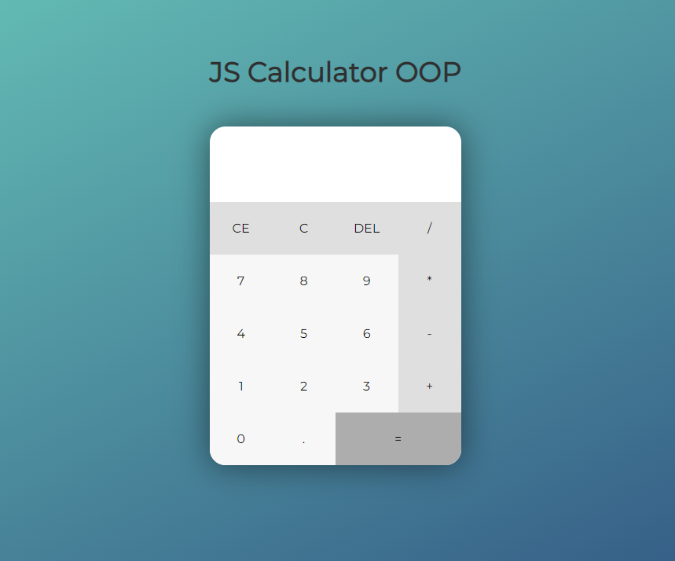
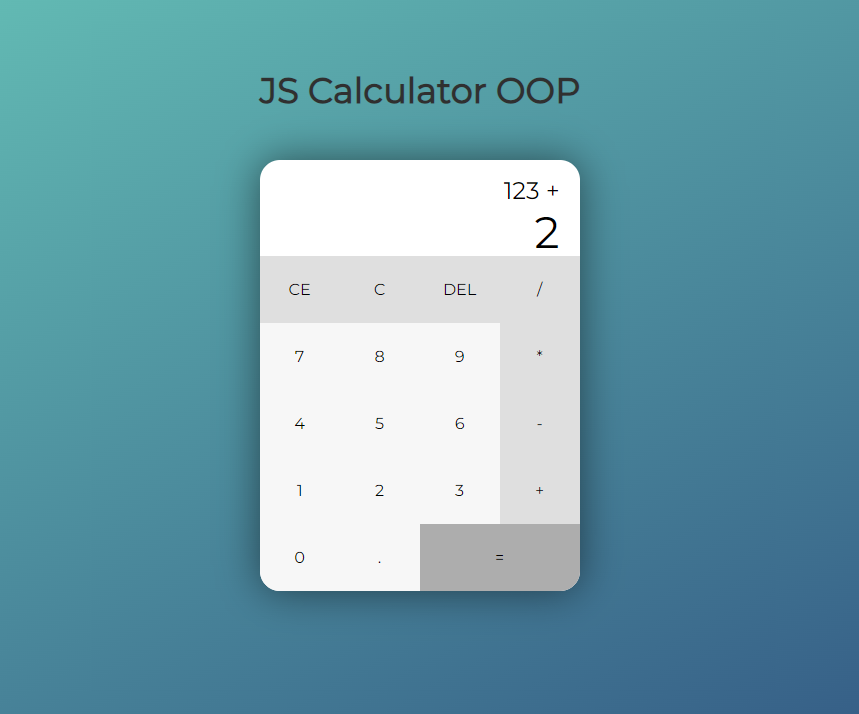

# JavaScript Calculator - OOP


[VIEW DEMO](https://daniorze.github.io/js-calculator-oop/)

Este projeto apresenta uma calculadora funcional feita em JavaScript, CSS3 e HTML5, utilizando conceitos de Programação Orientada a Objetos (OOP) para suas operações.

<p align="center">
  <p>
    
    
  </p>
  
## Features

- [x] Interface amigável utilizando CSS3 e HTML5.
- [x] Utilização de JavaScript para manipulação do DOM.
- [x] Aplicação de conceitos de Programação Orientada a Objetos em JavaScript para realizar operações.
- [x] Realização das operações básicas de matemática: multiplicação, divisão, adição e subtração.
- [x] Implementação da função de apagar todos os campos (C).
- [x] Implementação da função de apagar apenas o campo recentemente digitado, sem alterar o valor superior da calculadora (CE).
- [x] Implementação da função de apagar apenas o último dígito inserido (DEL).
- [x] Implementação da função de igual para mostrar apenas o resultado da operação na tela (=).
- [x] Implementação da função de alterar o operador enquanto não houver número recente digitado.
- [x] Implementação da função de, ao clicar em outro operador, gerar a operação já existente na tela antes de modificá-la.

## Começando

- Clone o repositório na sua máquina:

```bash
git clone https://github.com/DaniOrze/js-calculator-poo
```

- Navegue até a pasta do projeto:

```bash
cd js-calculator-poo
```

### Rodando a aplicação:

- Abra o arquivo index.html no seu browser padrão.
- A aplicação estará pronta para uso.

## Contribuições

Contribuições são bem-vindas! Caso encontre algum ponto a ser melhorado ou sugestões, abra uma issue ou mande um pull request para o repositório.

## Licença

Este projeto está licenciado pelo [MIT](./LICENSE).
